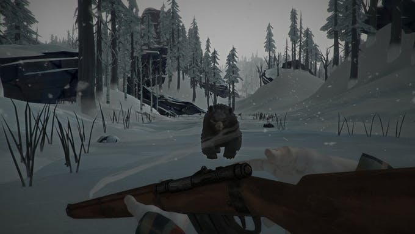
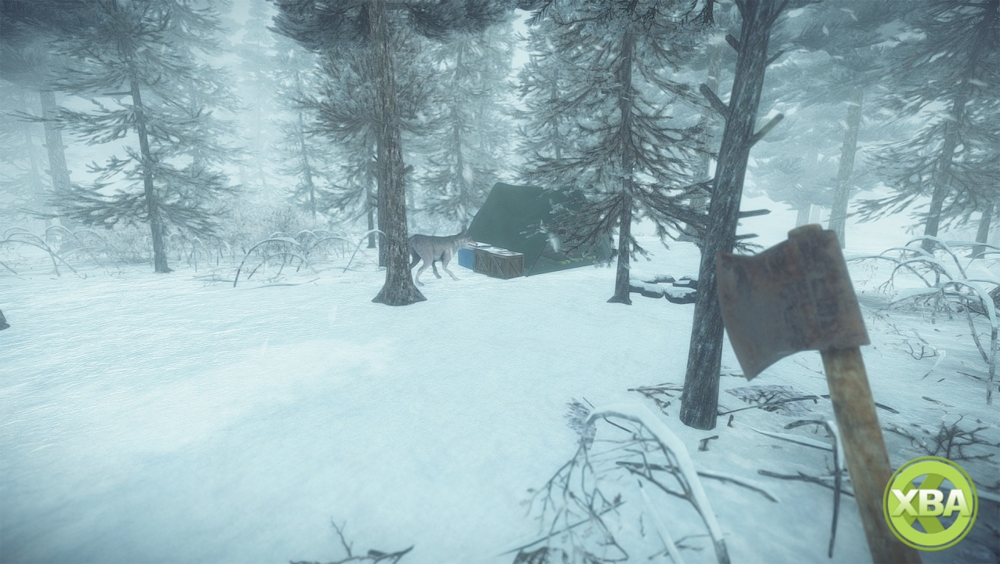
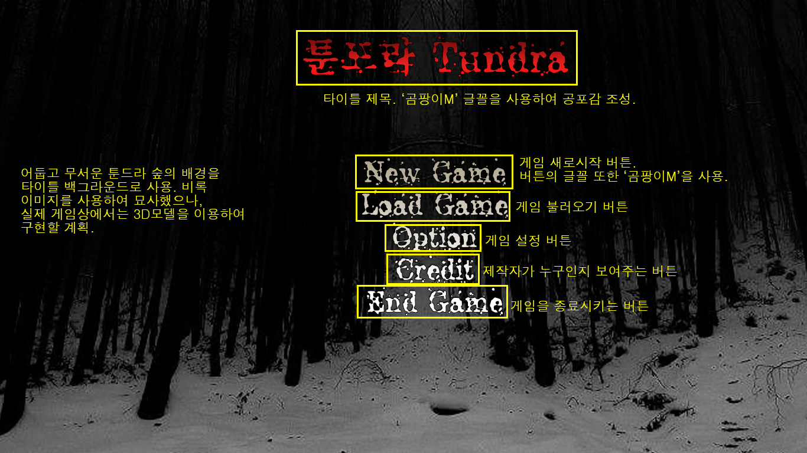
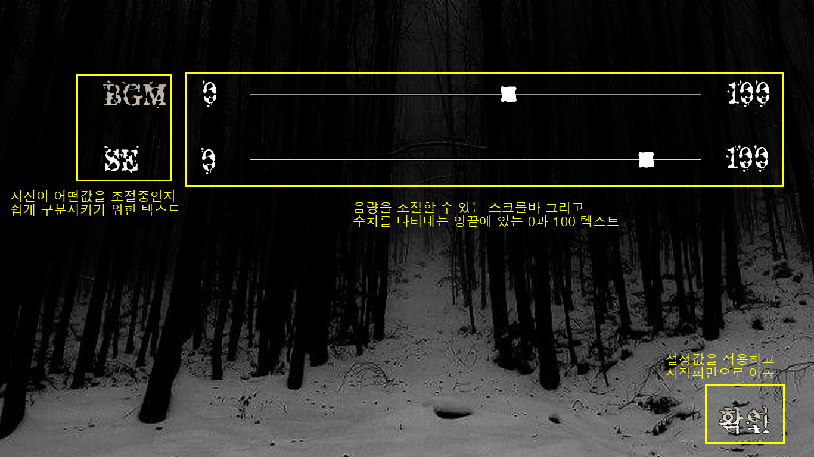
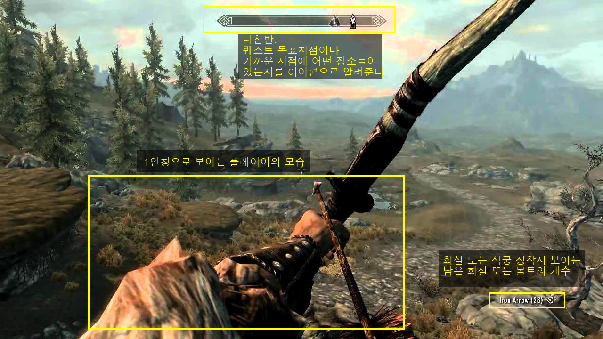

# - TUNDRA -  

# [ 목차 ]
### 1. [컨셉](#1)
### 2. [관련 이미지와 동영상](#2)
### 3. [대표 이미지 그리고 컨셉과 대표이미지 기반 작품 묘사](#3)
### 4. [TUNDRA의 구성 요소](#4)
### 5. [게임 시스템 디자인](#5)
### 6. [게임 오브젝트 분해](#6)
### 7. [파라미터](#7)
### 8. [행동](#8)
### 9. [상태](#9)
### 10. [플레이어 캐릭터 속성](#10)
### 11. [게임의 규칙](#11)
### 12. [게임에서 사용될 공식](#12)
### 13. [요구사항](#13)
### 14. [키보드 이벤트에 대한 흐름도](#14)
### 15. [용어 정리](#15)
### 16. [개발 작업](#16)

# [ 컨셉 ] 
## 1. 메인컨셉
### 1-1. 현실감
- 현실처럼 배고픔이나 피로도 목마름같은 여러 생존 변수를 두어
난이도를 상승시킨체로 게임을 진행
- 또한 시간의 흐름(낮->밤)또한 현실감있게 구현하여 플레이어가
게임에 더욱 더 잘 몰입할 수 있게 돕기
## 2. 서브 컨셉
### 2-1. 긴장갑
- 게임 플레이를 진행하면서 플레이어에게 끊임없이 생존 변수와
플레이어의 생존을 원하지 않는 몬스터들의 침공으로 계속하여
긴장감을 부여
### 2-2. 공포
- 또한 시간의 흐름을 구현한다면 밤이라는 시간이 올텐데, 이
밤이라는 때를 매우 효율적으로 활용할 예정(게임 분위기자체가
공포게임처럼 변화)
### 2-3. 시간
- 시간이 지나면 지날수록 점점 강한 몬스터들이 나와 플레이어의
생존을 방해
### 2-4. 위기감
- 일정주기마다 플레이어에게 계속 미니보스를 보내서
플레이어에게 위기감을 부여함
### 2-5. 편의성
- 조작감이나 여러 기능들을 접근하는데 있어서 그런 부분들이
불편하거나 힘들다면 아무리 게임이 재미있어도 소용없다고
판단
- 편의성을 생각하며 개발을 할 예정

# [ 관련 이미지와 동영상 ]
## 1. 관련 이미지
### 1-1. 날씨, 플레이어 시점 그리고 지형환경 오브젝트 배치
- 이미지의 날씨 느낌과 플레이어 1인칭 뷰 그리고 지형환경 오브젝트(바위, 나무 등)의 배치를 바탕으로 관련 이미지로 선정했습니다.
- 
### 1-2. 안개, 텍스쳐 그리고 쉐이더
- 이미지의 안개와 텍스쳐 그리고 쉐이더를 바탕으로 관련 이미지로 선정했습니다.
- 
## 2. 관련 동영상
- 영상에서 나오는 공포스러운 분위기와 1인칭 느낌 그리고 괴물의 움직임과 행동을 바탕으로 관련 동영상으로 선정했습니다.
- 

# [ 대표 이미지 그리고 컨셉과 대표이미지 기반 작품 묘사 ]
## 1. 시작 화면
- 
## 2. 설정 화면
- 
## 3. 게임 화면
- 
- 플레이어의 캐릭터의 체력이 매우 낮아 위험한 상황이라면 화면이 마치 피가 묻은것처럼 화면의 가장자리가 붉어지며, **플레이어에게 긴장감, 공포, 위기감을 느끼게 하여** 플레이어가 위험한 상황이라는 것을 **자각**시킴.
- 플레이어가 지구력이 낮거나 배고프다면 **특정 효과음을 재생**하여 현재 플레이어가 지구력이 부족하고 배고프다는것을 알림. 
- 목마를 경우, 체력이 낮아 위험한것처럼 **화면의 가장자리가 주황색으로 변하면서** 캐릭터가 목마르다는것을 알림.

# [ TUNDRA의 구성 요소 ]
## 1. 메커니즘
- 
## 2. 이야기
### 2-1.
## 3. 미적요소
## 4. 기술

# [ 게임 시스템 디자인 ]

# [ 게임 오브젝트 분해 ]

# [ 파라미터 ]

# [ 행동 ]

# [ 상태 ]

# [ 플레이어 캐릭터 속성 ]

# [ 게임의 규칙 ]

# [ 게임에서 사용될 공식 ]

# [ 요구사항 ]

# [ 키보드 이벤트에 대한 흐름도 ]

# [ 용어 정리 ]

# [ 개발 작업 ]
