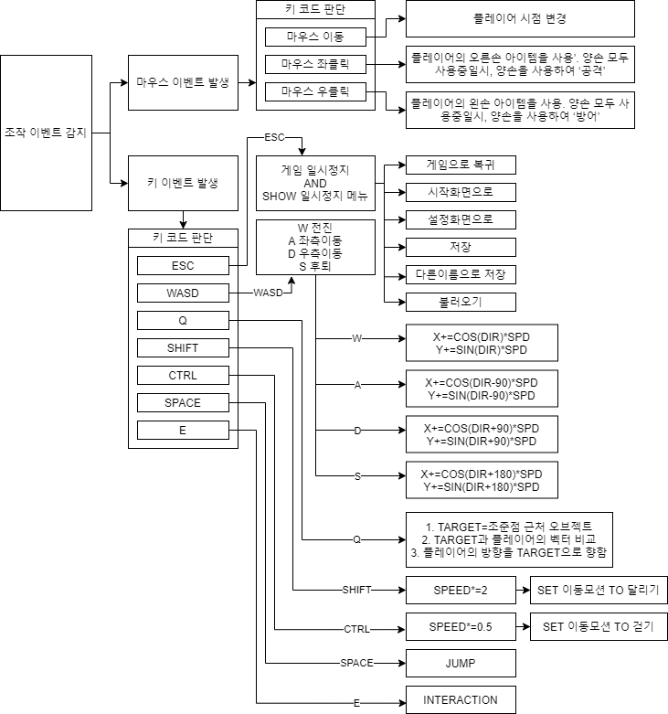

# - TUNDRA -  

# [ 목차 ]
## 1. [컨셉](#1)
## 2. [관련 이미지와 동영상](#2)
## 3. [대표 이미지](#3)
## 4. [컨셉과 대표이미지 기반 작품묘사](#4)
## 5. [TUNDRA의 구성 요소](#5)
## 6. [게임 시스템 디자인](#6)
## 7. [게임 오브젝트 분해](#7)
## 8. [파라미터](#8)
## 9. [행동](#9)
## 10. [상태](#10)
## 11. [플레이어 캐릭터 속성](#11)
## 12. [게임의 규칙](#12)
## 13. [게임에서 사용될 공식](#13)
## 14. [요구사항](#14)
## 15. [키보드 이벤트에 대한 흐름도](#15)
## 16. [용어 정리](#16)
## 17. [개발 작업](#17)

# [ 컨셉 ] <a name='1'></a>
## 1. 메인컨셉 : 현실감
- 현실처럼 배고픔이나 피로도 목마름같은 여러 생존 변수를 두어
난이도를 상승시킨체로 게임을 진행<br />
- 또한 시간의 흐름(낮->밤)또한 현실감있게 구현하여 플레이어가
게임에 더욱 더 잘 몰입할 수 있게 돕기<br />
- 게임의 장르는 생존게임(Open world survival craft).<br />

## 2. 서브 컨셉 1 : 긴장감
- 게임 플레이를 진행하면서 플레이어에게 끊임없이 생존 변수와
플레이어의 생존을 원하지 않는 몬스터들의 침공으로 계속하여
긴장감을 부여<br />

## 3. 서브 컨셉 2 : 공포
- 또한 시간의 흐름을 구현한다면 밤이라는 시간이 올텐데, 이
밤이라는 때를 매우 효율적으로 활용할 예정(게임 분위기자체가
공포게임처럼 변화)<br />

## 4. 서브 컨셉 3 : 시간
- 시간이 지나면 지날수록 점점 강한 몬스터들이 나와 플레이어의
생존을 방해<br />

## 5. 서브 컨셉 4 : 위기감
- 일정주기마다 플레이어에게 계속 미니보스를 보내서
플레이어에게 위기감을 부여함.<br />

## 6. 서브 컨셉 5 : 편의성
- 조작감이나 여러 기능들을 접근하는데 있어서 그런 부분들이
불편하거나 힘들다면 아무리 게임이 재미있어도 소용없다고
판단<br />
- 편의성을 생각하며 개발을 할 예정<br />

# [ 관련 이미지와 동영상 ]<a name='2'></a>
## 1. 관련 이미지

## 2. 관련 동영상
[](http://www.youtube.com/watch?v=pXZo8EE7X7M "tundraConceptVideo")

# [ 요구사항 ] <a name='14'></a>

## 1. 전체
- 시작화면, 설정화면, 게임화면, 점수화면 총 4개의 화면이 존재한다.

## 2. 시작화면
- 시작화면에는 새로하기, 이어하기, 게임설정, 게임종료 총 4개의 버튼이 존재한다.<br />
- 새로하기 버튼은 게임을 새로 시작하며 깨끗한 데이터에서 게임을 시작하며 게임화면으로 이동시킨다.<br />
- 이어하기 버튼은 게임을 불러와서 시작하며 저장해둔 세이브로 게임을 시작하며 게임화면으로 이동시킨다.<br />
- 게임설정 버튼은 설정화면으로 이동시킨다.<br />
- 게임종료 버튼은 게임을 종료시킨다.<br />

## 3. 설정화면
- 설정화면에는 효과음 조절 스크롤, 효과음 음소커 체크박스, 배경음 조절 스크롤, 배경음 음소커 체크박스가 존재한다.<br />
- 효과음 조절 스크롤은 재생되는 모든 효과음의 불륨을 0%에서 00%까지 조절할 수 있다.<br />
- 효과음 음소거 체크박스는 재생되는 모든 효과음을 0% 또는 100%로 조절할 수 있다.<br />
- 배경음 조절 스크롤은 재생되는 모든 효과음의 불륨을 0%에서 100%까지 조절할 수 있다.<br />
- 배경음 음소거 체크박스는 재생되는 모든 효과음을 0% 또는 100%로 조절할 수 있다.<br />

## 4. 게임화면
- 게임화면에는 화면하단에는 배고픔 바, 목마름 바, 피로도 바, 생명력 바, 지구력 바가 존재한다. 화면 정 가운데에는 조준점을 보여주는 크로스헤어가 존재한다. 화면하단(100%)부터 화면중앙윗부분(25%)까지는 플레이어(플레이어의 왼쪽팔에서 왼쪽손, 오른쪽팔에서 오른쪽손, 플레이어가 장비중인 아이템)가 보인다.<br />
-배고픔 바, 목마름 바, 피로도 바, 생명력 바, 지구력 바는 플레이어의 배고픔, 목마름, 피로도, 생명력, 지구력을 나타낸다.<br />
- 크로스헤어는 플레이어의 조준점을 나타낸다.<br />
- 플레이어(플레이어의 왼쪽팔에서 왼쪽손, 오른쪽팔에서 오른쪽손, 플레이어가 장비중인 아이템)는 1인칭 시점으로 보이는 플레이어를 나타낸다. 플레이어가 장비중인 방어구아이템과 무기아이템에 따라서 모습이 달라진다.<br />
- 조작은 W(전진) A(왼쪽으로 걷기) D(오른쪽으로 걷기) S(뒤로 걷기) Q-Toggle(락온) E(상호작용) Shift-Toggle(달리기) Ctrl-Toggle(걷기) SpaceBar(구르기) 마우스 움직이기(플레이어의 시점 회전) 마우스 왼쪽 클릭(플레이어의 오른손 아이템을 사용'. 양손 모두 사용중일시, 양손을 사용하여 '공격') 마우스 오른쪽 클릭(플레이어의 왼손 아이템을 사용. 양손 모두 사용중일시, 양손을 사용하여 '방어'.)<br />

## 5. 점수화면
- 점수화면에는 총점 텍스트, 생존날짜 텍스트, 킬수 텍스트, 확인 버튼이 존재한다.<br />
- 총점 텍스트는 플레이어가 게임을 진행하면서 얻은 점수를 나타낸다. 총점 텍스트 위에 마우스를 올리면 <br />

``` '소비아이템획득: '+소비아이템점수+'+장비아이템획득: '+장비아이템점수+'+재료아이템획득: '+재료아이템점수+'+적을 죽임: '+적을죽여서얻은점수 ```

- 라고 적힌 텍스트가 들어있는 툴팁박스가 마우스 위에 보이며, 마우스를 총점텍스트에서 떨어뜨리면 툴팁박스는 사라진다. 점수는 소비 아이템 획득시 10점, 장비 아이템 획득시 20점, 재료 아이템 획득시 5점, 적을 죽일시 100점을 얻는다.<br />
- 생존날짜 텍스트는 플레이어가 이 게임에서 얼마나 버텼는지를 나타낸다.<br />
- 킬수 텍스트는 플레이어가 이 게임에서 총 몇명의 적을 죽였는지를 나타낸다.<br />
- 확인 버튼은 시작화면으로 이동시킨다.<br />

# [ 키보드 이벤트에 대한 흐름도 ] <a name='3'></a>

