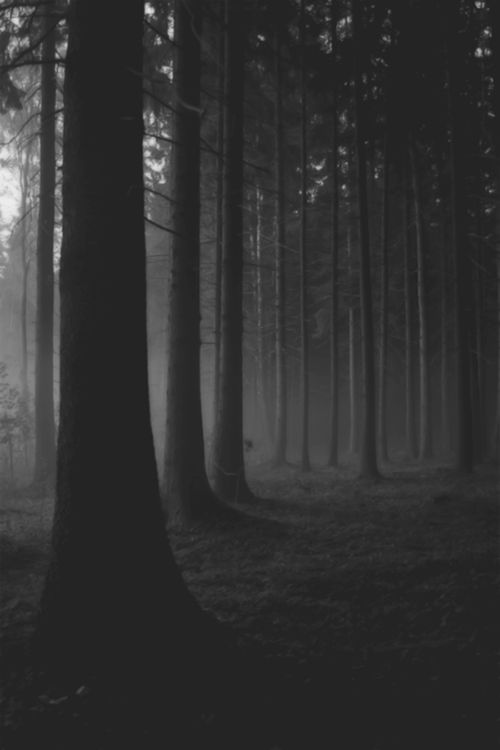
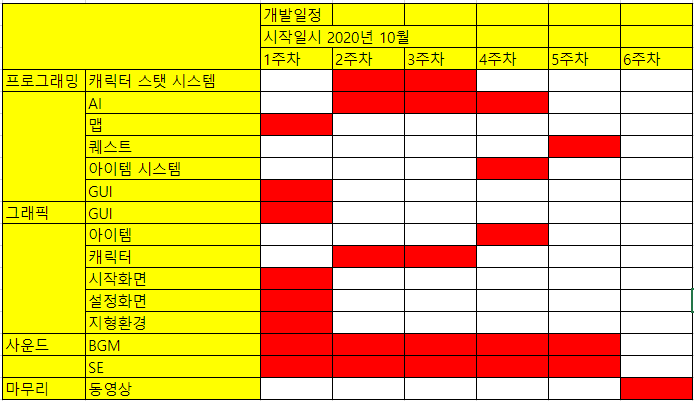

# - TUNDRA -  

# [ 목차 ]
### 1. [컨셉](#1)
### 2. [관련 이미지와 동영상](#2)
### 3. [대표 이미지 그리고 컨셉과 대표이미지 기반 작품 묘사](#3)
### 4. [TUNDRA의 구성 요소](#4)
### 5. [게임 시스템 디자인](#5)
### 6. [요구사항](#6)
### 7. [키보드 이벤트에 대한 흐름도](#7)
### 8. [용어 정리](#8)
### 9. [개발 작업](#9)

# [ 컨셉 ] <a name='1'></a>
## 1. 메인컨셉
### 1-1. 현실감
- 현실처럼 배고픔이나 피로도 목마름같은 여러 생존 변수를 두어
난이도를 상승시킨체로 게임을 진행
- 또한 시간의 흐름(낮->밤)또한 현실감있게 구현하여 플레이어가 게임에 더욱 더 잘 몰입할 수 있게 돕기
## 2. 서브 컨셉
### 2-1. 긴장갑
- 게임 플레이를 진행하면서 플레이어에게 끊임없이 생존 변수와
플레이어의 생존을 원하지 않는 몬스터들의 침공으로 계속하여
긴장감을 부여
### 2-2. 공포
- 또한 시간의 흐름을 구현한다면 밤이라는 시간이 올텐데, 이
밤이라는 때를 매우 효율적으로 활용할 예정(게임 분위기자체가
공포게임처럼 변화)
### 2-3. 시간
- 시간이 지나면 지날수록 점점 강한 몬스터들이 나와 플레이어의
생존을 방해
### 2-4. 위기감
- 일정주기마다 플레이어에게 계속 미니보스를 보내서
플레이어에게 위기감을 부여함
### 2-5. 편의성
- 조작감이나 여러 기능들을 접근하는데 있어서 그런 부분들이
불편하거나 힘들다면 아무리 게임이 재미있어도 소용없다고
판단
- 편의성을 생각하며 개발을 할 예정

# [ 관련 이미지와 동영상 ]<a name='2'></a>
## 1. 관련 이미지
### 1-1. 날씨, 플레이어 시점 그리고 지형환경 오브젝트 배치
- 이미지의 날씨 느낌과 플레이어 1인칭 뷰 그리고 지형환경 오브젝트(바위, 나무 등)의 배치를 바탕으로 관련 이미지로 선정했습니다.
- 
### 1-2. 안개, 텍스쳐 그리고 쉐이더
- 이미지의 안개와 텍스쳐 그리고 쉐이더를 바탕으로 관련 이미지로 선정했습니다.
- 
## 2. 관련 동영상
- 영상에서 나오는 공포스러운 분위기와 1인칭 느낌 그리고 괴물의 움직임과 행동을 바탕으로 관련 동영상으로 선정했습니다.
- [](http://www.youtube.com/watch?v=pXZo8EE7X7M "tundraConceptVideo")

# [ 대표 이미지 그리고 컨셉과 대표이미지 기반 작품 묘사 ]<a name='3'></a>
## 1. 시작 화면
- 
## 2. 설정 화면
- 
## 3. 게임 화면
- 
- 플레이어의 캐릭터의 체력이 매우 낮아 위험한 상황이라면 화면이 마치 피가 묻은것처럼 화면의 가장자리가 붉어지며, **플레이어에게 긴장감, 공포, 위기감을 느끼게 하여** 플레이어가 위험한 상황이라는 것을 **자각**시킴.
- 플레이어가 지구력이 낮거나 배고프다면 **특정 효과음을 재생**하여 현재 플레이어가 지구력이 부족하고 배고프다는것을 알림. 
- 목마를 경우, 체력이 낮아 위험한것처럼 **화면의 가장자리가 주황색으로 변하면서** 캐릭터가 목마르다는것을 알림.

# [ TUNDRA의 구성 요소 ]<a name='4'></a>
## 1. 메커니즘
### 1-1. 도전 과제
- 적을 죽이거나 서브 퀘스트를 수행하여 경험치를 얻고 레벨을 올리면서 캐릭터를 성장시키기
- 메인 퀘스트 수행
### 1-2. 재미 요소
- 퀘스트를 하면서 알 수 있는 스토리
- 플레이어가 강해지면서 출현하는 적도 강해짐
## 2. 이야기
- 자신의 형과 아버지의 복수를 하기위해 어떤 남자의 부대에 합류하여 싸우다가 자신이 토르의 환생이라는것을 깨닫고 라그나로크를 막아 세계를 구하는 스토리
## 3. 미적요소
### 3-1. 디자인
- 바이킹 건축양식과 툰드라 지형환경을 섞어 추운 북부에서 생활하는 것처럼 느낌이 들게 디자인
### 3-2. 컬러
- 추운 툰드라와 공포적인 느낌을 살리기 위해 어두운 파란색, 검은색, 회색, 흰색, 붉은색을 중심으로 색디자인을 이용할 예정
### 3-3. 음향
- 배경음악은 바이킹 전통음악을 대부분 넣음. 전투 배경음악의 경우에는 긴박감이 밀려오는 음악을 사용.
- 효과음은 검, 도끼, 창 등 근접 무기 소리와 활, 석궁 등 원거리 무기 소리도 사용.
- 갑옷을 입고 움직일때 나는 소리도 사용할 예정. 
- 이외에 음식을 먹는 소리, 액체를 마시는 소리, 지구력이 부족해 숨이 차는 소리, 체력이 낮아 심장이 두근 거리는 소리 등 많은 효과음을 이용해 플레이어가 더욱 더 높은 몰입감을 가지게 할 예정.
## 4. 기술
- 유니티 엔진을 사용하여 제작하여 AI, 애니매이션, 지형제작 등을 손쉽게 접근하여 제작
- blender를 이용하여 3d 모델을 모델링하고 모델의 애니매이션을 손쉽게 제작

# [ 게임 시스템 디자인 ]<a name='5'></a>
## 1. 게임 오브젝트 분해


|연번|오브젝트 이름|오브젝트 이미지|
|---|---|---|
|1|캐릭터(PC/NPC)||
|2|건물||
|3|아이템||
|4|지형환경||
|5|대화||


## 2. 파라미터


### 2-1. 캐릭터(PC/NPC)


|속성|영문명칭|설명|
|---|---|---|
|이름|name|캐릭터의 이름|
|나이|age|캐릭터의 나이|
|체력|hp|0이 되면 죽는다|
|지구력|sp|-
|공격력|dmg|-|
|방어력|armor|-|
|이동속도|spd|-|
|숙련도 포인트|weaponPoint|숙련도 점수를 올릴 수 있음|
|스킬 포인트|skillPoint|스킬 점수를 올릴 수 있음|
|부대 한계치|partySize|-|
|부대 임금|partyCost|-
|부대 사기|partyHappy|-
|힘|str|체력1, 공격력 약간 증가|
|민첩|agi|이동속도 증가, 숙련도 포인트+5, 지구력 약간 증가|
|지능|int|스킬 포인트+1|
|카리스마|chr|부대한계치+1|
|스킬 단단한피부|skiIronSkin|1점당 체력+2|
|스킬 강타|skiStrike|1점당 근접공격력+8%|
|스킬 던지는힘|skiThrowStr|1점당 투척무기공격력+10%|
|스킬 당기는힘|skiBowStr|1점당 활공격력+14%|
|스킬 무기의달인|skiWeaponMaster|1점당 숙련도 한계치+40|
|스킬 방패술|skiShield|1점당 방패가 받는 피해-8%|
|스킬 운동능력|skiSpeed|1점당 이동속도 증가|
|스킬 훈련교관|skiTrainer|1점당 플레이어의 부대원이 받는 경험치가 증가|
|스킬 설득|skiSpeech|1점당 설득의 성공 확률 증가|
|스킬 항해|skiSeaDrive|1점당 바다에서의 선박 이동 속도 증가|
|스킬 수술|skiHeal|1점당 수술 난이도 감소|
|스킬 상술|skiTrade|1점당 거래 패널티 감소|
|스킬 리더쉽|skiLeadership|1점당 부대한계치+5, 부대임금-5%, 부대사기+5%|
|숙련도 한손무기|skiOnehanded|해당 무기 공격속도 증가|
|숙련도 양손무기|skiTwohanded|해당 무기 공격속도 증가|
|숙련도 폴암|skiSpear|해당 무기 공격속도 증가|
|숙련도 투척무기|skiThrow|해당 무기 공격속도 증가|
|숙련도 활|skiBow|해당 무기 공격속도 증가|
|숙련도 석궁|skiCrossbow|해당 무기 공격속도 증가|
|배고픔|hunger|-|
|목마름|thirsty|-|
|피로함|tired|-|


### 2-2. 건물


|속성|영문명칭|설명|
|---|---|---|
|초가집|house|주민들이 사는 집|
|대장간|blackSmith|대장장이의 작업장과 집|
|주점|inn|주민들이 술이나 음식을 먹으러 오는 곳|
|잡화점|store|잡다한 물건을 팔거나 사는 곳|
|노점|standMarket|노점|
|우물|well|물을 기르거나 퍼는곳|
|항구|dock|군선, 상선, 어선을 정박해두는곳|
|조선소|shipyard|바이킹들의 선박이나 어선 또는 상선을 만드는 곳.|
|병영|barrack|부족의 전사들이 머무르거나 훈련을 하는 곳. 무기를 저장해두기도함.|
|야를의궁전|palace|부족의 야를과 그 가족들이 사는 곳|


### 2-3. 아이템


|속성|영문명칭|설명
|---|---|---|
|무기 아이템|weaponItem|짧은검,장작도끼,단창,검,도끼,창,군용검,전쟁도끼,장창,장검,양손도끼,사냥활,긴활,석궁,나무화살,돌화살,나무볼트,돌볼트,횃불|
|방어구 아이템|armorItem|농노의옷,대장장이의옷,상인의옷,노동자의옷,가죽갑옷,가죽투구,사슬갑옷,사슬투구,바이킹투구|
|음식 아이템|foodItem|빵,햄,청어,우유,치즈,맥주,벌꿀술,포도주|
|기타 아이템|ectItem|퀘스트 전용 아이템이라거나 등등|


### 2-4. 지형환경


|속성|영문명칭|설명|
|---|---|---|
|나무|tree|-|
|풀|grass|-|
|바위|rock|-|
|꽃|flower|-|
|물|water|-|


### 2-5. 대화


|속성|영문명칭|설명|
|---|---|---|
|상대의 말|speak_str|-|
|선택지리스트|chooseList|-|


## 3. 행동


### 3-1. 캐릭터(PC/NPC)


|행동|설명
|---|---|
|대기|아무것도 안함|
|상호작용|상호작용 실행|
|맞음|공격에 맞음|
|공격|-|
|방어|-|


## 4. 상태


### 4-1. 캐릭터(PC/NPC)


|현상태|전이상태|전이조건|
|---|---|---|
|정상|부상|체력50%이하|
|정상|위기|체력20%이하|
|정상|지침|지구력 50%이하|
|정상|탈진|지구력 20%이하|
|정상|배고픔|배고픔50%이하|
|정상|굶주림|배고픔20%이하|
|정상|목마름|목마름50%이하|
|정상|갈증|목마름20%이하|
|정상|졸림|피로도50%이하|
|정상|매우졸림|피로도20%이하|


## 5. 플레이어 캐릭터 속성


|속성|영문명칭|설명|
|---|---|---|
|이름|name|캐릭터의 이름|
|나이|age|캐릭터의 나이|
|체력|hp|0이 되면 죽는다|
|지구력|sp|-
|공격력|dmg|-|
|방어력|armor|-|
|이동속도|spd|-|
|숙련도 포인트|weaponPoint|숙련도 점수를 올릴 수 있음|
|스킬 포인트|skillPoint|스킬 점수를 올릴 수 있음|
|부대 한계치|partySize|-|
|부대 임금|partyCost|-
|부대 사기|partyHappy|-
|힘|str|체력1, 공격력 약간 증가|
|민첩|agi|이동속도 증가, 숙련도 포인트+5, 지구력 약간 증가|
|지능|int|스킬 포인트+1|
|카리스마|chr|부대한계치+1|
|스킬 단단한피부|skiIronSkin|1점당 체력+2|
|스킬 강타|skiStrike|1점당 근접공격력+8%|
|스킬 던지는힘|skiThrowStr|1점당 투척무기공격력+10%|
|스킬 당기는힘|skiBowStr|1점당 활공격력+14%|
|스킬 무기의달인|skiWeaponMaster|1점당 숙련도 한계치+40|
|스킬 방패술|skiShield|1점당 방패가 받는 피해-8%|
|스킬 운동능력|skiSpeed|1점당 이동속도 증가|
|스킬 훈련교관|skiTrainer|1점당 플레이어의 부대원이 받는 경험치가 증가|
|스킬 설득|skiSpeech|1점당 설득의 성공 확률 증가|
|스킬 항해|skiSeaDrive|1점당 바다에서의 선박 이동 속도 증가|
|스킬 수술|skiHeal|1점당 수술 난이도 감소|
|스킬 상술|skiTrade|1점당 거래 패널티 감소|
|스킬 리더쉽|skiLeadership|1점당 부대한계치+5, 부대임금-5%, 부대사기+5%|
|숙련도 한손무기|skiOnehanded|해당 무기 공격속도 증가|
|숙련도 양손무기|skiTwohanded|해당 무기 공격속도 증가|
|숙련도 폴암|skiSpear|해당 무기 공격속도 증가|
|숙련도 투척무기|skiThrow|해당 무기 공격속도 증가|
|숙련도 활|skiBow|해당 무기 공격속도 증가|
|숙련도 석궁|skiCrossbow|해당 무기 공격속도 증가|
|배고픔|hunger|-|
|목마름|thirsty|-|
|피로함|tired|-|
|장착중인오른손|equipRight|-|
|장착중인왼손|equipLeft|-|
|장착중인방어구|equipBody|-|
|장착중인투구|equipHelmet|-|


## 6. 게임의 규칙
### 6-1. 핵심 규칙
- hp가 0이되면 패배
### 6-2. 보조 규칙
- 스킬: 플레이어의 능력에 영향을 끼치며 스킬 포인트와 각종 능력치를 이용하여 성장시킬 수 있다.
- 숙련도: 플레이어의 무기 숙련도. 민첩을 올려 숙련도 포인트를 얻어 성장시킬 수 있다.
## 7. 게임에서 사용될 공식
-이동
```
dir=0~359
switch(fow){
  case 0: fowr=0 break
  case 1: fowr=90 break
  case 2: fowr=-90 break
  case 3: fowr=180 break
}
x+=cos(dir+fowr)*spd
y+=sin(dir+fowr)*spd
```

# [ 요구사항 ]<a name='6'></a>
## 1. 시작화면
- 화면 윗쪽에는 붉은색 글씨로 툰드라 Tundra라고 적혀있는 텍스트가 있다.
- 화면 중앙에는 New Game, Load Game, Option, Credit, End Game 버튼이 세로로 정렬되어 있다.
- New Game은 게임을 새로 시작하며 바로 게임화면으로 이동한다.
- Load Game은 이전에 저장되어있는 세이브를 선택한다음 게임화면으로 이동한다. 이전에 저장되어있는 세이브가 없다면 에러를 발생시킨다.
- Option은 설정화면으로 이동한다.
- Credit 제작자를 메시지로 띄운다.
- End Game은 게임을 종료시킨다.
## 2. 설정화면
- 좌측에는 BGM, SE 중앙~우측에는 0,스크롤,100이 있다. 우측하단에는 확인버튼이 있다.
- BGM, SE 텍스트는 현재 어떤값을 조정하는지 알려주는 목적의 텍스트 오브젝트이다.
- 0과 100은 플레이어가 수치를 더 쉽게 조절하기 위한 텍스트 오브젝트이다.
- 스크롤은 BGM 또는 SE의 음량을 조절할 수 있다.
- 확인 버튼은 설정을 마치고 시작화면으로 이동한다.
## 3. 게임화면
- 상단에는 나침반, 중앙~하단에는 플레이어 1인칭 뷰 모델, 우측 하단에는 남은 화살 또는 볼트의 개수가 있다.
- 나침반은 목표 지점이나 가까운 지점에 어떤 장소들이 있는지를 아이콘으로 알려준다.
- 플레이어 1인칭 뷰 모델은 플레이어를 나타낸다. 입고있는 무기, 갑옷에 따라 달라진다.
- 우측 하단에 있는 남은 화살 또는 볼트의 개수 텍스트는 플레이어가 활 또는 석궁을 장착하고 있을때만 보인다.
- 나머지 뒷부분으로는 게임 배경이 보인다.

# [ 키보드 이벤트에 대한 흐름도 ]<a name='7'></a>


# [ 용어 정리 ]<a name='8'></a>


# [ 개발 작업 ]<a name='9'></a>

